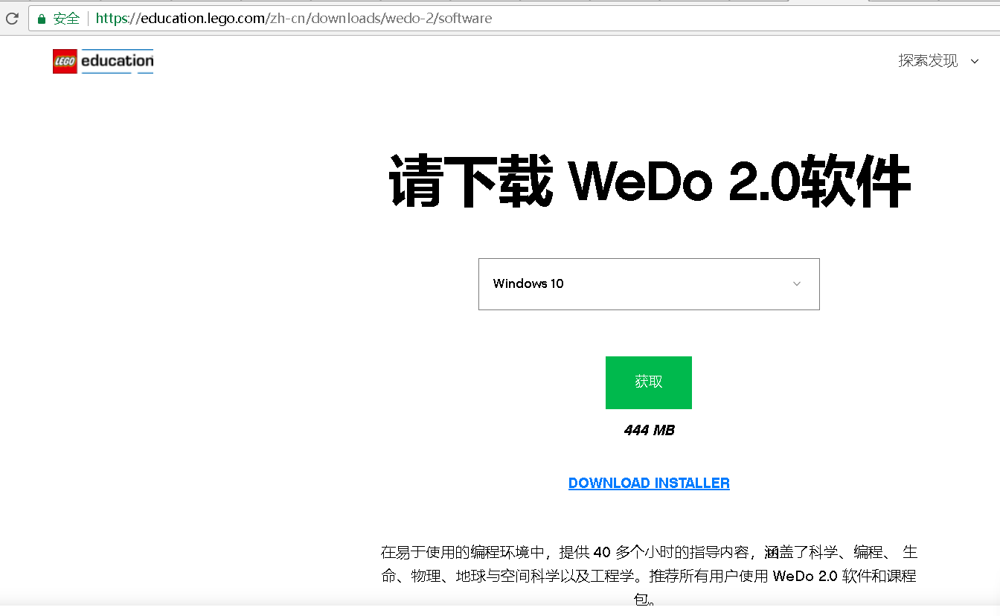
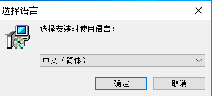

# 安裝
### 1. 登录乐高教育网站下载最新wedo2.0软件 [https://education.lego.com/zh-cn/downloads/wedo-2/software](https://education.lego.com/zh-cn/downloads/wedo-2/software)

  

### 2. 下载成功后双击安装文件并开始安装,请选择语言

  

### 3. 接收协议。

  

### 4. 选择安装路径

  

### 5. 创建快捷方式

  

### 6. 选择下一步

  

### 7. 选择安装

  

### 8. 等待安装完成

  

### 9. 选择结束，并出现图标在桌面

  

### 10. 点击同意

  

### 11. 按右面的箭头

  

### 12. 按到第四个按开始

  

### 13. 如果没开蓝牙按“继续在无蓝牙支持的情况下使用该应用程序”

  

### 14. 成功打开界面

